# Отчет по работе "Assymmetric Ciphers"

## Основное задание

1. Реализовать протокол Диффи-Хеллмана в виде клиент-серверного приложения.
2. Реализовать клиент-серверную пару, которая шифрует сообщения асимметричным способом.
## Ход выполнения работы

Реализован протокол Диффи-Хеллмана в виде клиент-серверного приложения. Файл сервера `dh_server` и файл клиента `dh_client`.

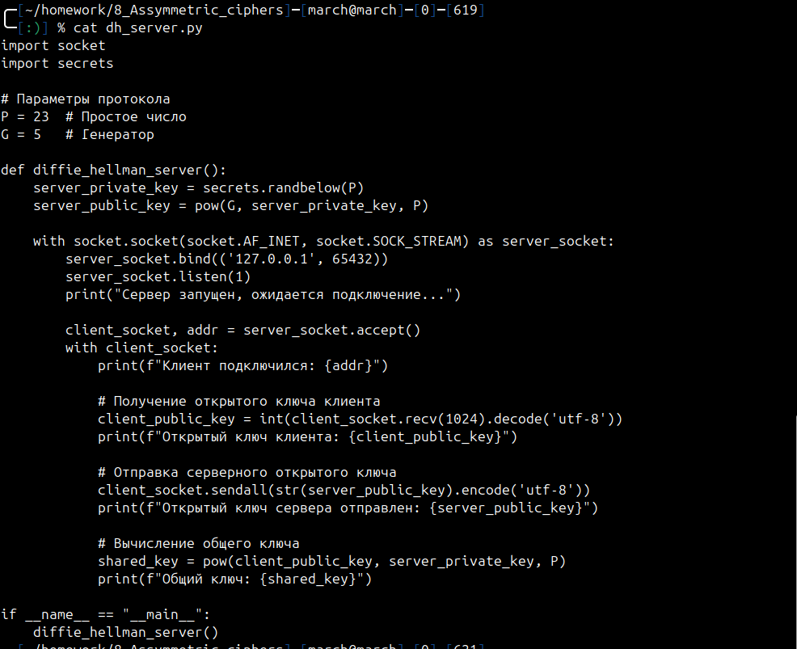
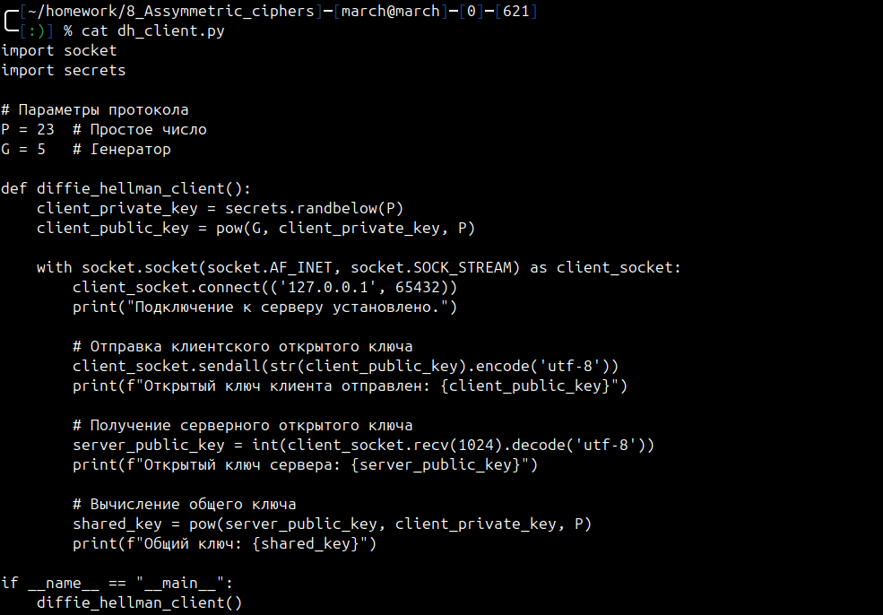

Запустим сервер и клиент. Как видим, они вычислили одинаковый общий ключ.

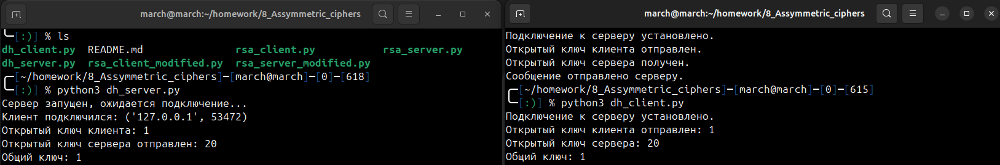

 Реализована клиент-серверная пара, которая шифрует сообщения асимметричным способом. Файл сервера `rsa_server` и файл клиента `rsa_client`.

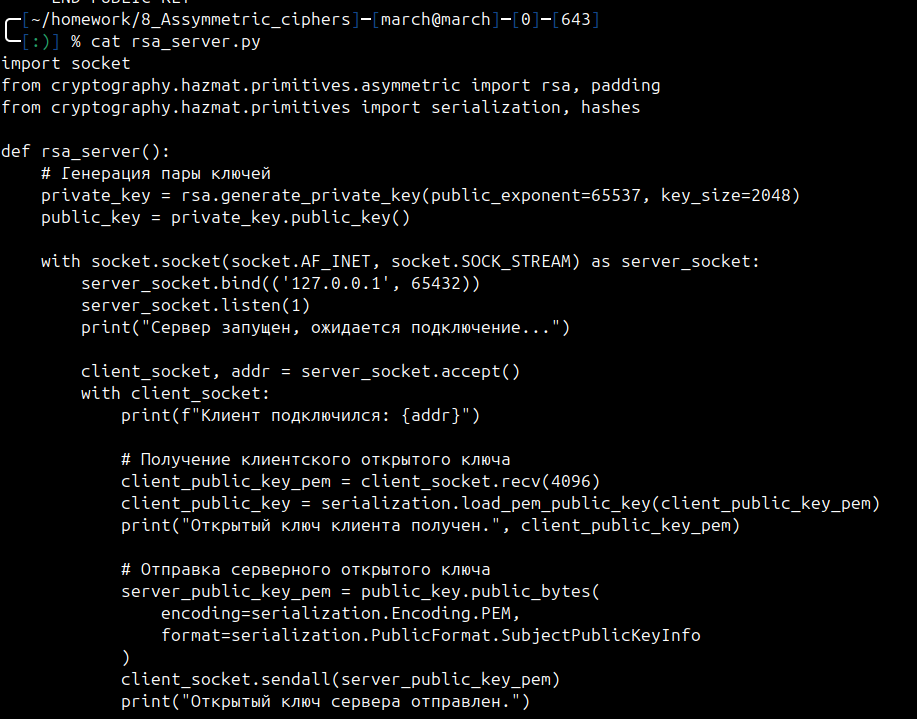
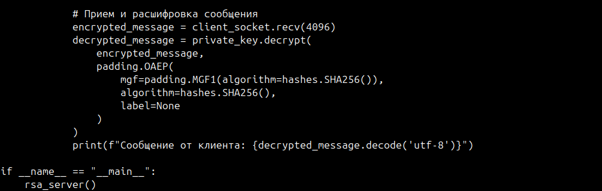

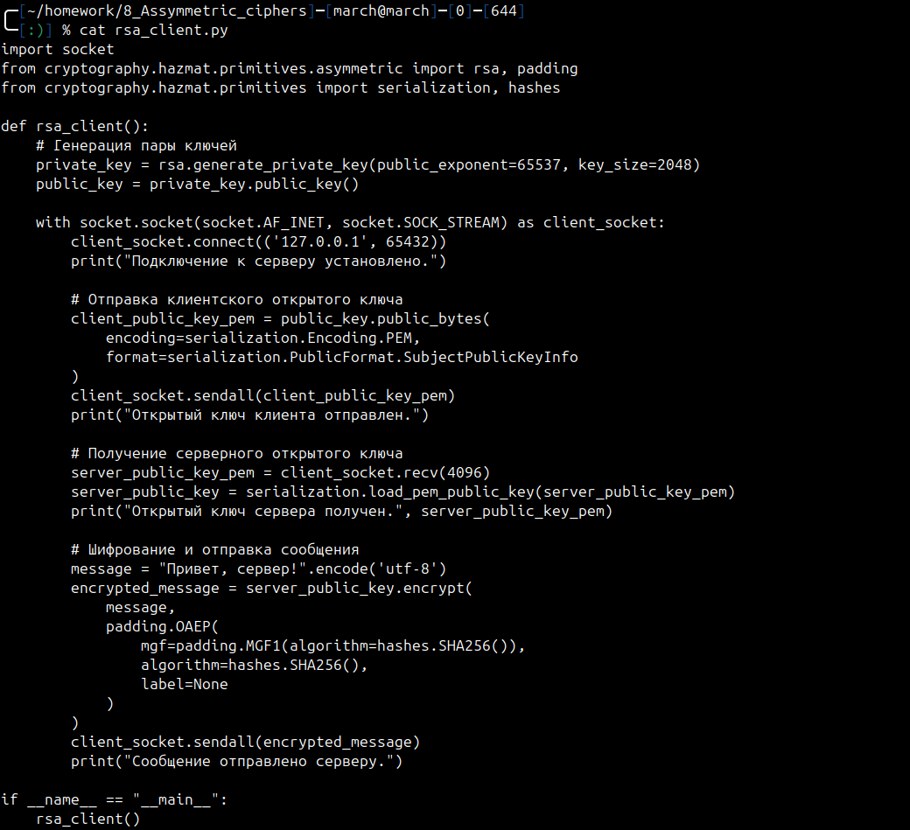

Клиент передает серверу сообщение **"Привет, сервер!"**.

Запустим сервер и клиент.

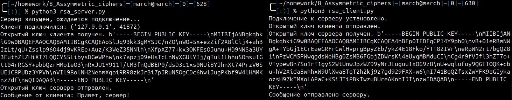

## Дополнительные задания

#### Модифицируйте код клиента и сервера так, чтобы приватный и публичный ключ хранились в текстовых файлах на диске и, таким образом, переиспользовались между запусками.

Модифицированный код запишем в новые файлы: для сервера `rsa_server_modified` и для клиента `rsa_client_modified`. 

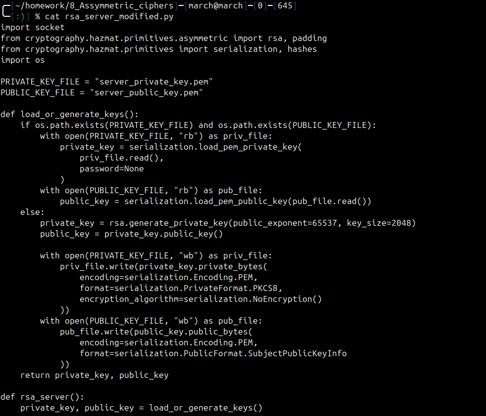
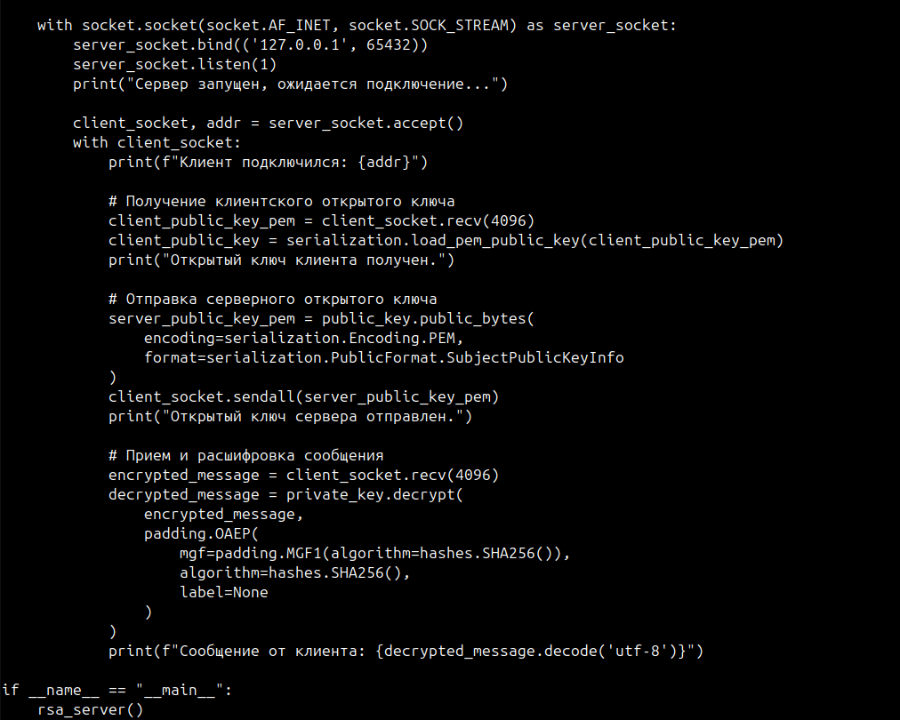

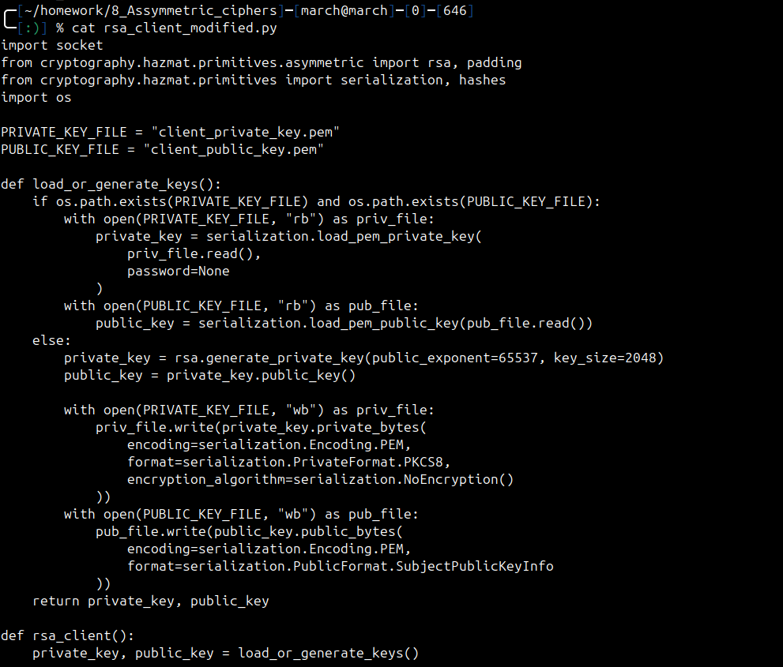
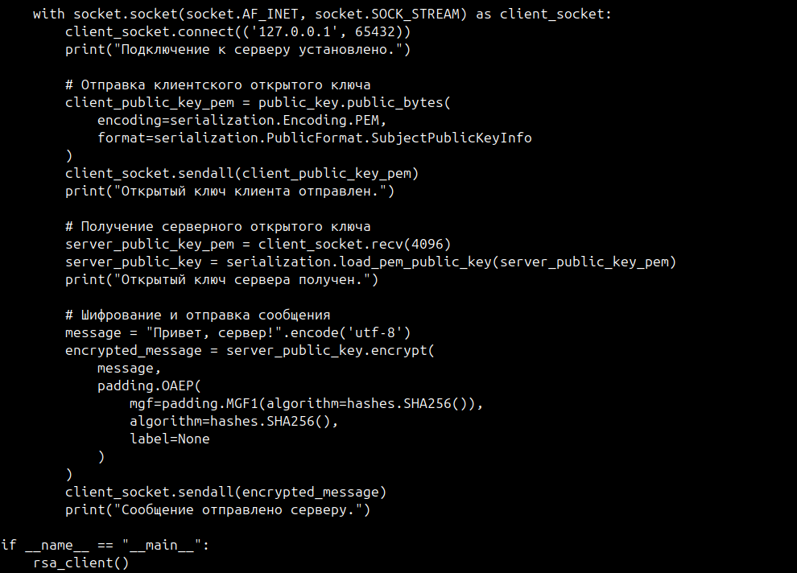

Теперь сгенерированные публичные и приватные ключи сохраняются в файлы, а при повторном запуске клиента и сервера переиспользуются. Если удалить файлы с ключами - программа сгенерирует новые. Запустим сервер и клиент.

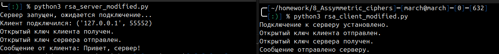

Содержимое файлов с приватными и публичными ключами:

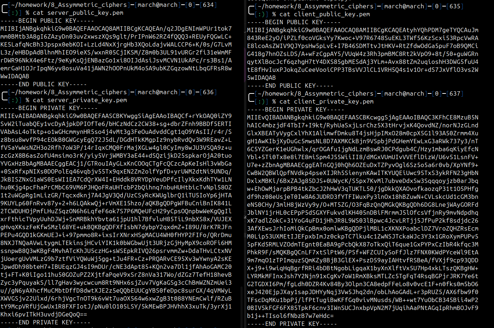
## Ответы на контрольные вопросы

- Как работает на практике протокол SSL?
    
    SSL (и его преемник TLS) обеспечивает защищенное соединение между клиентом и сервером. Основные шаги:
	1. **Handshake (рукопожатие):** Обмен сертификатами и согласование алгоритмов шифрования.
	2. **Генерация ключей:** Используется асимметричное шифрование (например, RSA или ECDHE) для обмена ключами.
	3. **Шифрование данных:** После установления соединения данные шифруются симметричным ключом для высокой производительности.
	4. **Проверка подлинности:** Сертификат сервера проверяется клиентом, чтобы подтвердить доверие.